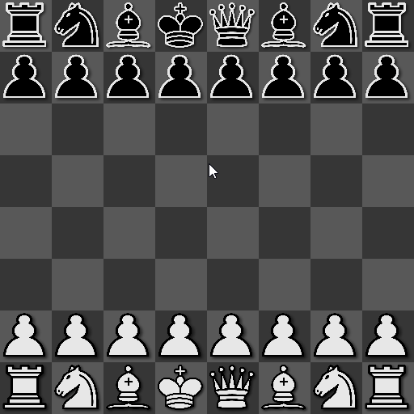

# Chessie
A playable Python GUI chess engine/game, with the goal of creating a base for making a self-learning chess AI.

# Motivation
I wanted to make a chess AI that can play decently above an average player but since I do not know how to play chess very well, it would take me a very long time to make a heuristics chess bot, so I decided to let the bot learn how to play itself rather than trying to teach it what I don't know.
It is also (kinda) my first GUI application so that was also a new learning experience.

## GUI demo:

# Features so far
* Player can only move at their correct turn.
* Undo.
* All pieces can only move legally.
* Working legal moves generation with efficient pins/checks validation.
* Functioning graphical rendering for selection, moves and captures highlighting.

# To-do
* Create an actual game with game over rules (when one king dies).
* Most important: A functioning machine learning framework.

# Acknowledgement
* Chess sprites from: 
> JohnPablok's improved Cburnett chess set.
> Found at: https://opengameart.org/content/chess-pieces-and-board-squares

* PyGame Chess introduction tutorial by Eddie Sharick.
> Found at: https://www.youtube.com/watch?v=EnYui0e73Rs

* Chessie logo modified by me, based on the artwork:
> Knight from: https://www.klipartz.com/en/sticker-png-csqlu#google_vignette

